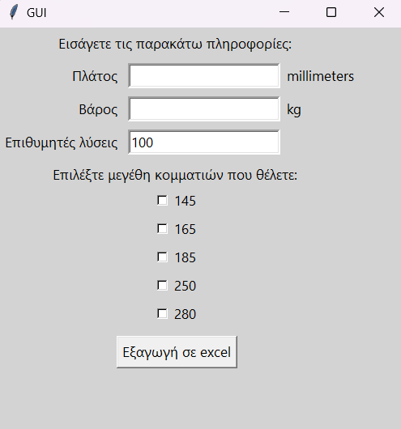

# CylinderCutter

This is a python project i made to help my dad with his job. He needed to cut cylinders  
in uneven pieces but without having extra cylinder material left. As you can imagine doing  
that in a piece of paper can be quite difficult.  
  
So, i wrote a program that calculates the top 100 solutions (by default, but can be changed)  
based on how little cylinder is left after the cuts. The results are exported in a csv file  
named "for_dad.csv" that can be later opened with excel to have a better visualisation of the data.  
  
In the csv file the data is stored in columns like so:  
1. First column -> Combination of cuts to be used on the cylinder  
2. The next 1-5 columns (depending on how many different piece sizes you want to use) are the piece size  
   at the top and the total weight of all the same pieces in each specific combination (row)  
3. The final column is the remaining length of the cylinder that can not be cut down further  
      
Also, because my dad hasn't any experience with handling code i made a GUI to make his  
job a little easier by using the tkinter library.  
  
Here is a screenshot of the GUI:

  
Excel visualisation instructions:  
  
After opening the csv with excel you select the whole first column. Then, you go to:
Data --> Text to Columns --> Choose "Delimited" --> Next --> Choose the delimiter:  
"Other" and write " / " in the text input --> Hit OK  

